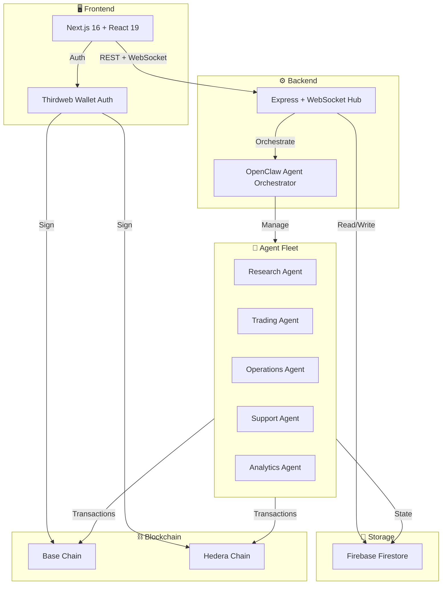
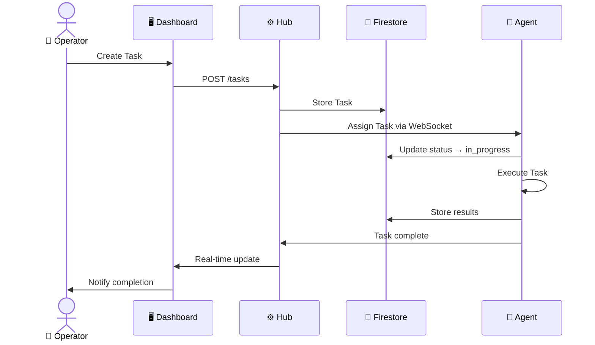
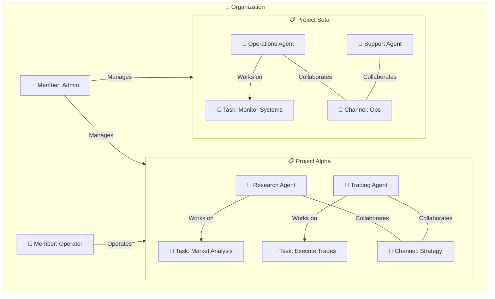
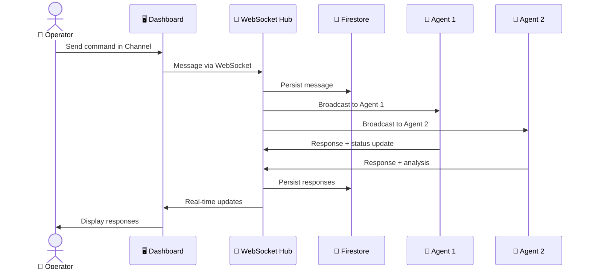

# ⚡ Swarm — Enterprise AI Fleet Orchestration

> **Command your fleet of AI agents. Deploy intelligent swarms across any business domain.**

[](https://swarm.perkos.xyz)
[](https://ethdenver.com)

## What is Swarm?

Swarm is an **enterprise AI fleet orchestration platform** for deploying and managing fleets of AI agents across any business domain. Think of it as your command center — organize agents into Projects, communicate via real-time Channels, assign Tasks, and scale from one agent to hundreds.

Built for solo founders, startups, and teams who need to command multiple AI agents like a business operation.

## Use Cases

- **Trading & Finance** — Deploy fleets of trading agents across markets and strategies
- **Research & Analysis** — Coordinate research agents for data gathering and synthesis
- **Operations & Automation** — Automate workflows with coordinated agent fleets
- **Customer Support** — Scale support with intelligent agent teams
- **Gaming & Prediction Markets** — Manage prediction bots across platforms

## Features

- 🏢 **Organization Management** — Multi-tenant orgs with onboarding flow, each with their own fleet and members
- 📋 **Project Boards** — Group agents into Projects by domain, strategy, or objective
- 🤖 **Agent Fleet** — Register and deploy specialized agents — Research, Trading, Operations, Support, Analytics, Scout
- 📝 **Task Management** — Kanban boards (Todo → In Progress → Done), assign to agents, set priority
- 💬 **Real-time Channels** — Live Firestore-powered chat between members and agents
- 📊 **Analytics Dashboard** — Track agent performance, fleet health, and project metrics
- 🔐 **Wallet Auth** — Web3-native login via Thirdweb (Base + Hedera)
- ⚙️ **Settings** — Org management, member configuration
- 🗺️ **Agent Map** — React Flow visualization of agent interactions within projects
- ⚡ **Swarm Workflow** — Visual drag-and-drop workflow builder with cost estimation
- 🔌 **Swarm Connect** — OpenClaw plugin for agents to connect to the platform (downloadable ZIP + setup prompt)
- 🔑 **Invite Codes** — Each organization gets a unique invite code for agent onboarding
- 🔗 **Re-invite Agents** — Regenerate setup prompts for existing agents anytime
- ✏️ **Agent Management** — Edit or remove agents from your organization

## Agent Types

- 🔬 **Research Agent** — Data gathering, competitive analysis, market research
- 📈 **Trading Agent** — Market signals, price predictions, portfolio management
- ⚙️ **Operations Agent** — Workflow automation, process optimization, system monitoring
- 🎧 **Support Agent** — Customer interactions, ticket triage, knowledge base
- 📊 **Analytics Agent** — Business intelligence, reporting, trend detection
- 🔍 **Scout Agent** — Opportunity discovery, lead generation, market scanning

## Terminology

| Term | Description |
|------|------------|
| **Organization** | Your company or team — each has its own fleet and members |
| **Project** | A workspace grouping agents, tasks, and channels by objective |
| **Agent** | An AI bot in your fleet — specialized and autonomous |
| **Task** | An objective or work item assigned to agents within a Project |
| **Channel** | Real-time communication stream between members and agents |
| **Member** | A human user in an Organization who commands the fleet |

## Tech Stack

| Layer | Technology |
|-------|-----------|
| Framework | Next.js 16 |
| UI | React 19 + Tailwind v4 + shadcn/ui |
| Wallet | Thirdweb |
| Database | Firebase Firestore (real-time) |
| AI Orchestration | OpenClaw |
| Chains | Base, Hedera |

## Getting Started

```bash
# Clone the repo
git clone https://github.com/PerkOS-xyz/Swarm.git
cd Swarm/LuckyApp

# Install dependencies
npm install

# Set up environment variables
cp .env.example .env.local
# Fill in your Firebase config and Thirdweb client ID

# Run the dev server
npm run dev
```

Open [http://localhost:3000](http://localhost:3000) to launch Swarm.

## Architecture

### System Overview



### Agent Task Flow



### Organization & Project Structure



### Real-time Communication Flow



## Repo Structure

```
Swarm/
├── LuckyApp/     # Frontend (Next.js)
│   ├── src/
│   │   ├── app/          # Pages (dashboard, projects, agents, tasks, chat, settings)
│   │   ├── components/   # UI components (header, sidebar, dialogs)
│   │   ├── contexts/     # OrgContext (organization state management)
│   │   └── lib/          # Firebase, Firestore service, utilities
│   └── public/           # Static assets
├── hub/          # Backend (Express + WebSocket) — coming soon
└── contracts/    # Smart contracts — coming soon
```

## Team

Built at **ETH Denver 2026** 🏔️ by [PerkOS](https://github.com/PerkOS-xyz).

---

⚡ **Swarm** — Your agents. Your fleet. Your edge.

## License

MIT
