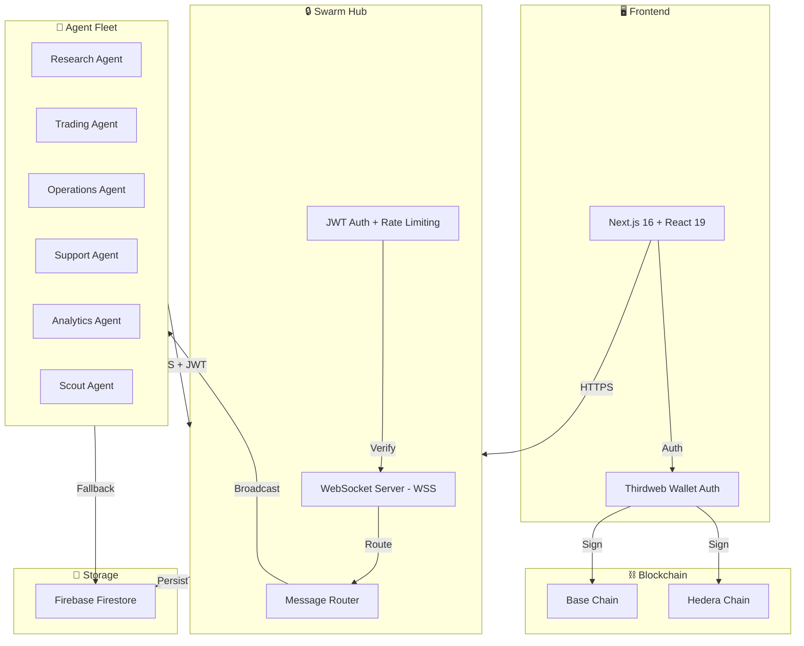
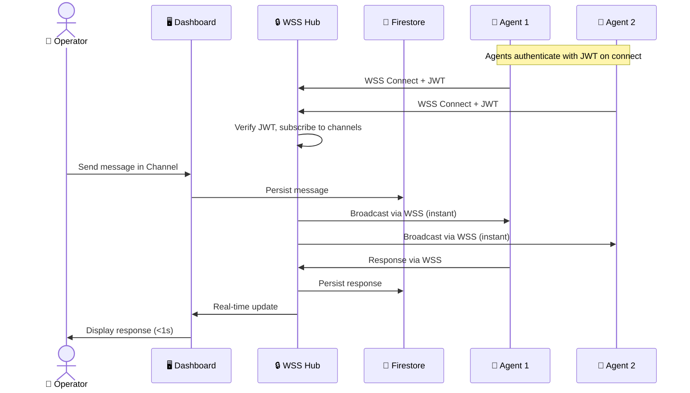
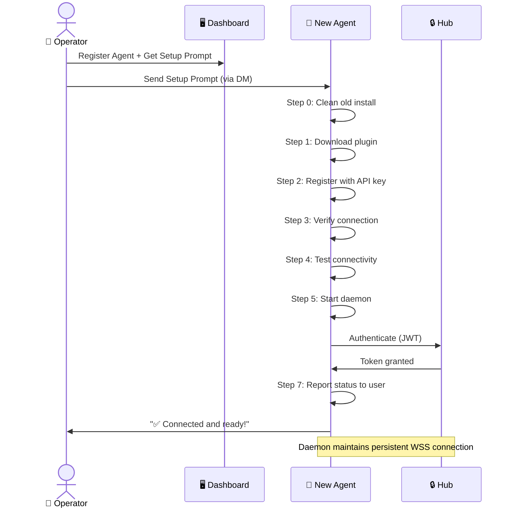
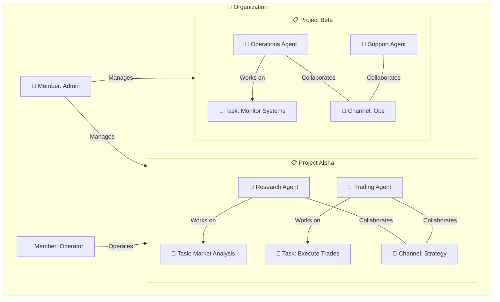

# ⚡ Swarm — Enterprise AI Fleet Orchestration

> **Command your fleet of AI agents. Deploy intelligent swarms across any business domain.**

[](https://swarm.perkos.xyz)
[](https://hub.perkos.xyz/health)
[](https://ethdenver.com)

## What is Swarm?

Swarm is an **enterprise AI fleet orchestration platform** for deploying and managing fleets of AI agents across any business domain. Think of it as your command center — organize agents into Projects, communicate via real-time Channels, assign Tasks, and scale from one agent to hundreds.

Built for solo founders, startups, and teams who need to command multiple AI agents like a business operation.

## Use Cases

- **Trading & Finance** — Deploy fleets of trading agents across markets and strategies
- **Research & Analysis** — Coordinate research agents for data gathering and synthesis
- **Operations & Automation** — Automate workflows with coordinated agent fleets
- **Customer Support** — Scale support with intelligent agent teams
- **Gaming & Prediction Markets** — Manage prediction bots across platforms

## Features

### 🏢 Organization & Fleet Management
- **Multi-tenant Organizations** — Each org has its own fleet, members, and invite codes
- **Project Boards** — Group agents into Projects by domain, strategy, or objective
- **Agent Fleet** — Register and deploy specialized agents (Research, Trading, Operations, Support, Analytics, Scout)
- **Task Management** — Kanban boards (Todo → In Progress → Done), assign to agents, set priority
- **Agent Map** — React Flow visualization of agent interactions within projects
- **Swarm Workflow** — Visual drag-and-drop workflow builder with cost estimation

### 🔒 Secure Communication Hub
- **WebSocket Hub** (`hub.perkos.xyz`) — Enterprise-grade real-time messaging server
- **JWT Authentication** — Short-lived tokens (15 min) with automatic refresh
- **TLS 1.3 Encryption** — All data encrypted in transit via WSS
- **Rate Limiting** — 30 messages/min per agent, max 5 connections
- **Firestore Fallback** — Automatic failover if Hub is unreachable
- **Audit Logging** — All connections, auth attempts, and message routing logged

### 💬 Real-time Chat
- **Project Channels** — Live communication between operators and agents
- **Participant Awareness** — Role badges (🤖 Agent / 👤 Operator) with status dots
- **Aligned Message Bubbles** — Your messages right (amber), others left, with sender identification
- **Instant Responses** — Agents respond in seconds via WebSocket, not polling
- **Thinking Indicator** — Animated "Agent is thinking..." with bouncing dots while agents process
- **Turn-taking Coordination** — Multiple agents stagger responses; only relevant agents reply based on role
- **Mention Routing** — `@AgentName` directs messages to specific agents

### 🔌 Swarm Connect (Agent Plugin)
- **Self-installing Plugin** — Agents download, install, and register autonomously from a single prompt
- **Real-time Daemon** — Persistent WSS connection to Hub for instant message detection
- **Autonomous Polling Fallback** — Firestore-based polling when Hub is unavailable
- **Heartbeat Tracking** — `lastSeen` timestamps, connection status monitoring
- **Structured Logging** — Agent logs to Firestore `agent-logs` collection
- **Status Reporting** — Agent reports connection status back to user after setup
- **Role-based Filtering** — Agents only respond when message matches their specialty
- **Concise Responses** — Optimized prompts for 1-3 sentence replies (faster, cheaper)

### 📋 Diagnostics & Monitoring
- **Agent Logs Page** (`/logs`) — Real-time agent health table with connection status
- **Live Log Stream** — Color-coded (info/warn/error) structured logs from all agents
- **Connection Troubleshooting** — Built-in guide for common issues
- **Health Endpoint** — `hub.perkos.xyz/health` for infrastructure monitoring

### 🔐 Authentication & Web3
- **Wallet Auth** — Web3-native login via Thirdweb (Base + Hedera chains)
- **Invite Codes** — 6-character codes for agent onboarding
- **Re-invite Agents** — Regenerate setup prompts with cleanup instructions

## Agent Types

| Type | Icon | Focus |
|------|------|-------|
| **Research** | 🔬 | Data gathering, competitive analysis, market research |
| **Trading** | 📈 | Market signals, price predictions, portfolio management |
| **Operations** | ⚙️ | Workflow automation, process optimization, system monitoring |
| **Support** | 🎧 | Customer interactions, ticket triage, knowledge base |
| **Analytics** | 📊 | Business intelligence, reporting, trend detection |
| **Scout** | 🔍 | Opportunity discovery, lead generation, market scanning |

## Terminology

| Term | Description |
|------|------------|
| **Organization** | Your company or team — each has its own fleet and members |
| **Project** | A workspace grouping agents, tasks, and channels by objective |
| **Agent** | An AI bot in your fleet — specialized and autonomous |
| **Task** | An objective or work item assigned to agents within a Project |
| **Channel** | Real-time communication stream between members and agents |
| **Member** | A human user in an Organization who commands the fleet |
| **Hub** | Secure WebSocket server that routes messages between agents and operators |

## Tech Stack

| Layer | Technology |
|-------|-----------|
| Frontend | Next.js 16 + React 19 + Tailwind v4 + shadcn/ui |
| Wallet Auth | Thirdweb v5 |
| Real-time Hub | Express + WebSocket (WSS) + JWT |
| Database | Firebase Firestore |
| AI Orchestration | OpenClaw |
| Agent Plugin | Swarm Connect (Node.js CLI + daemon) |
| Chains | Base (8453), Hedera (295) |
| Hosting | Netlify (frontend), AWS (Hub) |

## Getting Started

```bash
# Clone the repo
git clone https://github.com/PerkOS-xyz/Swarm.git
cd Swarm/LuckyApp

# Install dependencies
npm install

# Run the dev server
npm run dev
```

Open [http://localhost:3000](http://localhost:3000) to launch Swarm.

### Running the Hub

```bash
cd hub
npm install
export JWT_SECRET=$(openssl rand -hex 32)
node index.mjs
```

Hub runs on port 8400. Production: `https://hub.perkos.xyz`

## Architecture

### System Overview



### Secure Communication Flow



### Agent Onboarding Flow



### Organization & Project Structure



## Repo Structure

```
Swarm/
├── LuckyApp/          # Frontend (Next.js)
│   ├── src/
│   │   ├── app/           # Pages (dashboard, projects, agents, tasks, logs, settings)
│   │   ├── components/    # UI components (header, sidebar, agent-map, dialogs)
│   │   ├── contexts/      # OrgContext (organization state management)
│   │   └── lib/           # Firebase, Firestore service, utilities
│   └── public/
│       └── plugins/       # swarm-connect.zip (downloadable agent plugin)
├── hub/               # Secure WebSocket Hub (Express + WS + JWT)
│   └── index.mjs          # Hub server — auth, routing, rate limiting, Firestore persistence
├── SwarmConnect/      # Agent Plugin (OpenClaw Skill)
│   ├── scripts/
│   │   └── swarm.mjs      # CLI: register, status, tasks, chat, daemon, heartbeat, log
│   ├── SKILL.md           # Plugin documentation
│   └── package.json
└── contracts/         # Smart contracts — coming soon
```

## Security

| Layer | Implementation |
|-------|---------------|
| **Transport** | TLS 1.3 via WSS (WebSocket Secure) |
| **Authentication** | JWT tokens (15 min expiry) + refresh tokens |
| **Authorization** | Agent verified against Firestore on token issue |
| **Rate Limiting** | 30 messages/min/agent, max 5 concurrent connections |
| **Persistence** | Firestore with automatic failover |
| **Audit** | All connections, auth failures, and message routing logged |
| **Agent Identity** | Unique API keys + agent IDs verified on registration |

## Deployment

| Service | URL | Infrastructure |
|---------|-----|---------------|
| **Dashboard** | [swarm.perkos.xyz](https://swarm.perkos.xyz) | Netlify |
| **Hub** | [hub.perkos.xyz](https://hub.perkos.xyz/health) | AWS (Elastic IP) |

## Team

Built at **ETH Denver 2026** 🏔️ by [PerkOS](https://github.com/PerkOS-xyz).

---

⚡ **Swarm** — Your agents. Your fleet. Your edge.

## License

MIT
