# ⚡ Swarm — Enterprise AI Fleet Orchestration

> **Command your fleet of AI agents. Deploy intelligent swarms across any business domain.**

[](https://luckyst-app.netlify.app)
[](https://ethdenver.com)

## What is Swarm?

Swarm is an **enterprise AI fleet orchestration platform** for deploying and managing fleets of AI agents across any business domain. Think of it as your command center — organize agents into Projects, communicate via real-time Channels, assign Tasks, and scale from one agent to hundreds.

Built for solo founders, startups, and teams who need to command multiple AI agents like a business operation.

## Use Cases

- **Trading & Finance** — Deploy fleets of trading agents across markets and strategies
- **Research & Analysis** — Coordinate research agents for data gathering and synthesis
- **Operations & Automation** — Automate workflows with coordinated agent fleets
- **Customer Support** — Scale support with intelligent agent teams
- **Gaming & Prediction Markets** — Manage prediction bots across platforms

## Features

- 🏢 **Organization Management** — Multi-tenant orgs, each with their own fleet and members
- 📋 **Project Boards** — Group agents into Projects by domain, strategy, or objective
- 🤖 **Agent Fleet** — Deploy specialized agents — each an expert in their domain
- 📋 **Task Management** — Assign objectives, set parameters, track execution
- 💬 **Real-time Channels** — Live communication between members and agents
- 📊 **Analytics Dashboard** — Track agent performance and fleet health at a glance
- 🔐 **Wallet Auth** — Web3-native login via RainbowKit + wagmi
- 🟢 **Live Status** — Real-time agent health, online/offline monitoring

## Agent Types

- 🔬 **Research Agent** — Data gathering, competitive analysis, market research
- 📈 **Trading Agent** — Market signals, price predictions, portfolio management
- ⚙️ **Operations Agent** — Workflow automation, process optimization, system monitoring
- 🎧 **Support Agent** — Customer interactions, ticket triage, knowledge base
- 📊 **Analytics Agent** — Business intelligence, reporting, trend detection
- 🔍 **Scout Agent** — Opportunity discovery, lead generation, market scanning

## Terminology

| Term | Description |
|------|------------|
| **Organization** | Your company or team — each has its own fleet and members |
| **Project** | A workspace grouping agents, tasks, and channels by objective |
| **Agent** | An AI bot in your fleet — specialized and autonomous |
| **Task** | An objective or work item assigned to agents within a Project |
| **Channel** | Real-time communication stream between members and agents |
| **Member** | A human user in an Organization who commands the fleet |

## Tech Stack

| Layer | Technology |
|-------|-----------|
| Framework | Next.js 16 |
| UI | React 19 + Tailwind v4 + shadcn/ui |
| Wallet | RainbowKit + wagmi |
| Database | Firebase Firestore |
| AI Orchestration | OpenClaw |
| Chains | Base, Hedera |

## Getting Started

```bash
# Clone the repo
git clone https://github.com/PerkOS-xyz/LuckySt.git
cd LuckySt

# Install dependencies
npm install

# Set up environment variables
cp .env.example .env.local
# Fill in your API keys and Firebase config

# Run the dev server
npm run dev
```

Open [http://localhost:3000](http://localhost:3000) to launch Swarm.

## Architecture

### System Overview


### Agent Task Flow

```mermaid
sequenceDiagram
    actor Operator as 👤 Operator
    participant UI as 🖥️ Dashboard
    participant Hub as ⚙️ Hub
    participant DB as 💾 Firestore
    participant Agent as 🤖 Agent

    Operator->>UI: Create Task
    UI->>Hub: POST /tasks
    Hub->>DB: Store Task
    Hub->>Agent: Assign Task via WebSocket
    Agent->>DB: Update status → in_progress
    Agent->>Agent: Execute Task
    Agent->>DB: Store results
    Agent->>Hub: Task complete
    Hub->>UI: Real-time update
    UI->>Operator: Notify completion
```



### Organization & Project Structure

```mermaid
graph TD
    subgraph Org["🏢 Organization"]
        subgraph P1["📋 Project Alpha"]
            A1[🤖 Research Agent]
            A2[🤖 Trading Agent]
            T1[📝 Task: Market Analysis]
            T2[📝 Task: Execute Trades]
            C1[💬 Channel: Strategy]
        end
        subgraph P2["📋 Project Beta"]
            A3[🤖 Operations Agent]
            A4[🤖 Support Agent]
            T3[📝 Task: Monitor Systems]
            C2[💬 Channel: Ops]
        end
        M1[👤 Member: Admin]
        M2[👤 Member: Operator]
    end

    M1 -->|Manages| P1
    M1 -->|Manages| P2
    M2 -->|Operates| P1
    A1 -->|Works on| T1
    A2 -->|Works on| T2
    A3 -->|Works on| T3
    A1 ---|Collaborates| C1
    A2 ---|Collaborates| C1
    A3 ---|Collaborates| C2
    A4 ---|Collaborates| C2
```



### Real-time Communication Flow

```mermaid
sequenceDiagram
    actor Op as 👤 Operator
    participant UI as 🖥️ Dashboard
    participant WS as 🔌 WebSocket Hub
    participant DB as 💾 Firestore
    participant A1 as 🤖 Agent 1
    participant A2 as 🤖 Agent 2

    Op->>UI: Send command in Channel
    UI->>WS: Message via WebSocket
    WS->>DB: Persist message
    WS->>A1: Broadcast to Agent 1
    WS->>A2: Broadcast to Agent 2
    A1->>WS: Response + status update
    A2->>WS: Response + analysis
    WS->>DB: Persist responses
    WS->>UI: Real-time updates
    UI->>Op: Display responses
```



## Repo Structure

```
LuckySt/
├── LuckyApp/     # Frontend (Next.js)
├── hub/          # Backend (Express + WebSocket)
└── contracts/    # Smart contracts
```

## Team

Built at **ETH Denver 2026** 🏔️ by [PerkOS](https://github.com/PerkOS-xyz).

---

⚡ **Swarm** — Your agents. Your fleet. Your edge.

## License

MIT
